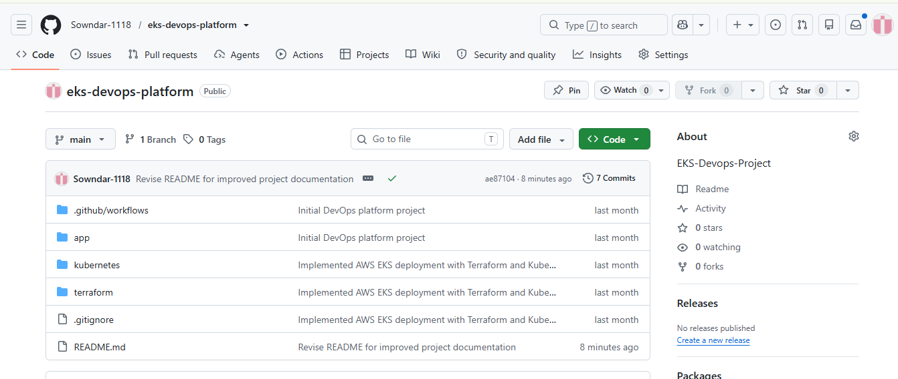
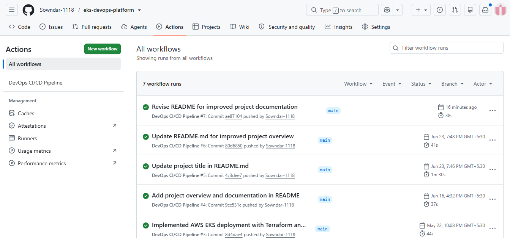
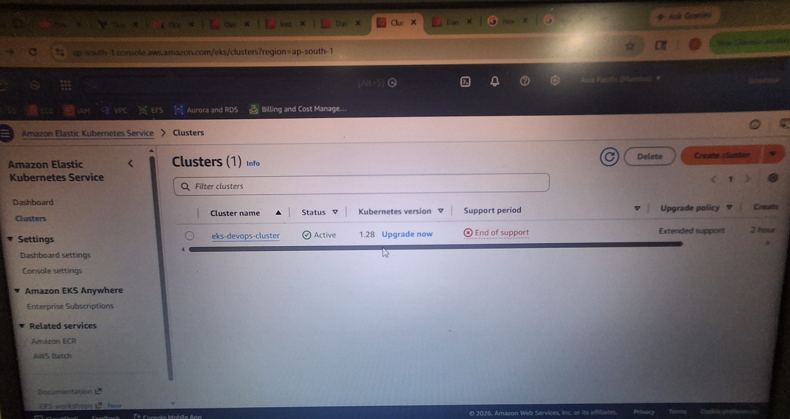
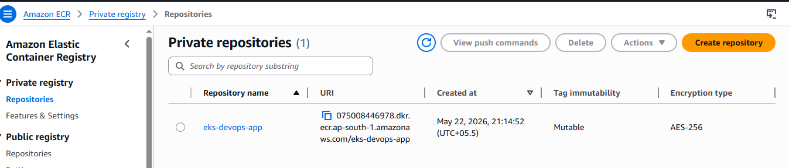
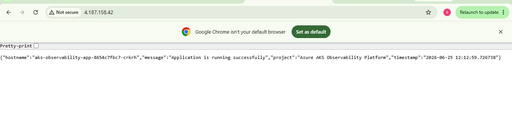

# Cloud-Native Application Deployment on Amazon EKS using Terraform, Docker, Amazon ECR and GitHub Actions

## Project Overview

This project demonstrates an end-to-end cloud-native application deployment on Amazon Elastic Kubernetes Service (EKS) using Terraform, Docker, Kubernetes, Amazon Elastic Container Registry (ECR), and GitHub Actions.

The infrastructure is provisioned using Terraform, while a Python Flask application is containerized with Docker and deployed to an Amazon EKS cluster. GitHub Actions is used to automate the Continuous Integration (CI) workflow by validating the application and building the Docker image whenever changes are pushed to the repository.

The container image is stored in Amazon ECR and deployed to Kubernetes using Kubernetes manifests. The application is exposed externally through an AWS Elastic Load Balancer.

This project was built to gain hands-on experience with Infrastructure as Code (IaC), Kubernetes, containerization, cloud-native application deployment, and DevOps practices on AWS.

---

# Architecture

Developer

↓

GitHub Repository

↓

GitHub Actions (Continuous Integration)

↓

Docker Image Build

↓

Amazon Elastic Container Registry (ECR)

↓

Amazon Elastic Kubernetes Service (EKS)

↓

Kubernetes Deployment

↓

Deployment + LoadBalancer Service

↓

AWS Elastic Load Balancer

↓

Python Flask Application

---

# Technology Stack

| Category                | Technologies                                        |
| ----------------------- | --------------------------------------------------- |
| Cloud                   | Amazon Web Services (AWS)                           |
| Infrastructure as Code  | Terraform                                           |
| Containerization        | Docker                                              |
| Container Registry      | Amazon Elastic Container Registry (ECR)             |
| Container Orchestration | Amazon Elastic Kubernetes Service (EKS), Kubernetes |
| Continuous Integration  | GitHub Actions                                      |
| Programming Language    | Python                                              |
| Framework               | Flask                                               |
| Operating System        | Ubuntu (WSL2)                                       |

---

# Project Structure

```text
eks-devops-platform/

├── .github/
│   └── workflows/
│       └── main.yml
│
├── app/
│   ├── app.py
│   ├── Dockerfile
│   └── requirements.txt
│
├── kubernetes/
│   ├── deployment.yaml
│   └── services.yaml
│
├── terraform/
│   ├── main.tf
│   ├── provider.tf
│   ├── outputs.tf
│   ├── variables.tf
│   └── .terraform.lock.hcl
│
├── screenshots/
│
└── README.md
```

---

# AWS Infrastructure Setup

Before provisioning the infrastructure, the following AWS configuration was completed:

* Created an IAM user (`terraform-admin`) with AdministratorAccess permissions for project purposes.
* Generated an AWS Access Key ID and Secret Access Key.
* Configured the AWS CLI using:

```bash
aws configure
```

This configuration enabled Terraform and the AWS CLI to authenticate and provision AWS resources.

---

# Infrastructure Provisioning using Terraform

Terraform was used to provision the complete infrastructure required for the Kubernetes platform.

The infrastructure includes:

* Amazon VPC
* Public Subnets
* Internet Gateway
* Route Tables
* Security Groups
* IAM Roles and Policies
* Amazon EKS Cluster
* Amazon EKS Managed Node Group

Terraform workflow:

```bash
terraform init

terraform plan

terraform apply
```

After provisioning, Terraform generated the EKS cluster endpoint and cluster name, which were used to configure kubectl access.

---

# Continuous Integration using GitHub Actions

The GitHub Actions workflow provides Continuous Integration (CI) for the application.

Whenever code is pushed to the **main** branch, the pipeline automatically performs the following tasks:

1. Checkout source code
2. Configure Python 3.9
3. Install application dependencies
4. Validate the Flask application
5. Build the Docker image

Workflow file:

```text
.github/workflows/main.yml
```

The deployment to Amazon EKS is performed manually after the container image is pushed to Amazon ECR.

---

# Docker Image Build and Push to Amazon ECR

The Flask application is containerized using Docker.

Docker workflow:

* Build the Docker image
* Authenticate Docker with Amazon ECR
* Tag the Docker image
* Push the image to Amazon ECR

Example commands:

```bash
docker build -t devops-platform .

docker tag devops-platform:latest \
ACCOUNT_ID.dkr.ecr.ap-south-1.amazonaws.com/eks-devops-app:latest

docker push \
ACCOUNT_ID.dkr.ecr.ap-south-1.amazonaws.com/eks-devops-app:latest
```

The Kubernetes Deployment references the image stored in Amazon ECR using:

```yaml
imagePullPolicy: Always
```

This ensures that worker nodes always pull the latest container image during deployment.

---

# Kubernetes Deployment on Amazon EKS

After pushing the Docker image to Amazon ECR, the application is deployed to Amazon EKS using Kubernetes manifests.

Resources deployed:

* Deployment
* LoadBalancer Service

Deployment configuration:

* Replica Count: 2
* Container Image stored in Amazon ECR
* Automatic image pull from Amazon ECR
* External access through AWS Elastic Load Balancer

Deployment commands:

```bash
kubectl apply -f deployment.yaml

kubectl apply -f services.yaml
```

The application becomes accessible through the DNS endpoint created by the AWS Elastic Load Balancer.

---

# Application Overview

The deployed Python Flask application displays runtime information collected from the Kubernetes Pod, including:

* Pod Hostname
* Operating System
* Linux Kernel Version
* Machine Architecture
* Application Execution Timestamp

This information helps verify successful Kubernetes deployment and confirms that the application is running inside the Amazon EKS cluster.

---

# Deployment Workflow

Developer

↓

GitHub Repository

↓

GitHub Actions (CI)

↓

Docker Image Build

↓

Amazon Elastic Container Registry (ECR)

↓

kubectl Deployment

↓

Amazon Elastic Kubernetes Service (EKS)

↓

Deployment + LoadBalancer Service

↓

AWS Elastic Load Balancer

↓

Python Flask Application

---

# Project Screenshots

### GitHub Repository



---

### GitHub Actions Pipeline



---


### Amazon EKS Cluster




---

### Amazon ECR Repository



---

### Python Flask Application



---

# Verification Commands

Configure kubectl:

```bash
aws eks update-kubeconfig \
--region ap-south-1 \
--name eks-devops-cluster
```

Verify worker nodes:

```bash
kubectl get nodes
```

Verify pods:

```bash
kubectl get pods
```

Verify deployments:

```bash
kubectl get deployments
```

Verify services:

```bash
kubectl get svc
```

---

# Author

**Sowndarraj M**

Cloud | DevOps | Network Engineer

AWS Certified Solutions Architect – Associate

GitHub: https://github.com/Sowndar-1118

LinkedIn: https://www.linkedin.com/in/sowndarraj-m-b35634200
